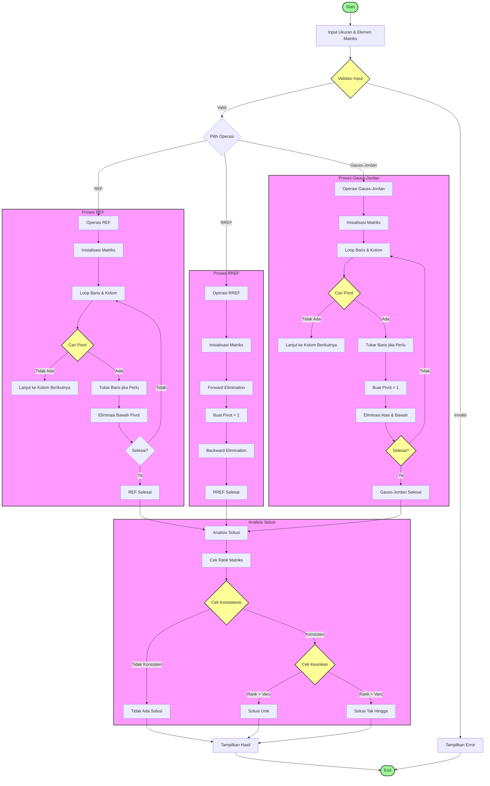

```mermaid
graph TB
    %% Main Flow
    Start([Start]) --> InputMatrix[Input Ukuran & Elemen Matriks]
    InputMatrix --> ValidateInput{Validasi Input}
    
    ValidateInput -->|Invalid| ShowError[Tampilkan Error]
    ValidateInput -->|Valid| OperationType{Pilih Operasi}
    
    %% Operation Types
    OperationType -->|REF| REFOperation[Operasi REF]
    OperationType -->|RREF| RREFOperation[Operasi RREF]
    OperationType -->|Gauss-Jordan| GJOperation[Operasi Gauss-Jordan]
    
    %% REF Operation Detail
    subgraph REF_Process[Proses REF]
        REFOperation --> REF_Init[Inisialisasi Matriks]
        REF_Init --> REF_Loop[Loop Baris & Kolom]
        REF_Loop --> REF_FindPivot{Cari Pivot}
        REF_FindPivot -->|Tidak Ada| REF_NextCol[Lanjut ke Kolom Berikutnya]
        REF_FindPivot -->|Ada| REF_SwapRows[Tukar Baris jika Perlu]
        REF_SwapRows --> REF_Eliminate[Eliminasi Bawah Pivot]
        REF_Eliminate --> REF_CheckDone{Selesai?}
        REF_CheckDone -->|Tidak| REF_Loop
        REF_CheckDone -->|Ya| REF_Complete[REF Selesai]
    end
    
    %% RREF Operation Detail
    subgraph RREF_Process[Proses RREF]
        RREFOperation --> RREF_Init[Inisialisasi Matriks]
        RREF_Init --> RREF_Forward[Forward Elimination]
        RREF_Forward --> RREF_MakePivots[Buat Pivot = 1]
        RREF_MakePivots --> RREF_Backward[Backward Elimination]
        RREF_Backward --> RREF_Complete[RREF Selesai]
    end
    
    %% Gauss-Jordan Operation Detail
    subgraph GJ_Process[Proses Gauss-Jordan]
        GJOperation --> GJ_Init[Inisialisasi Matriks]
        GJ_Init --> GJ_Loop[Loop Baris & Kolom]
        GJ_Loop --> GJ_FindPivot{Cari Pivot}
        GJ_FindPivot -->|Tidak Ada| GJ_NextCol[Lanjut ke Kolom Berikutnya]
        GJ_FindPivot -->|Ada| GJ_SwapRows[Tukar Baris jika Perlu]
        GJ_SwapRows --> GJ_MakePivotOne[Buat Pivot = 1]
        GJ_MakePivotOne --> GJ_EliminateAll[Eliminasi Atas & Bawah]
        GJ_EliminateAll --> GJ_CheckDone{Selesai?}
        GJ_CheckDone -->|Tidak| GJ_Loop
        GJ_CheckDone -->|Ya| GJ_Complete[Gauss-Jordan Selesai]
    end
    
    %% Solution Analysis
    REF_Complete --> AnalyzeSolution[Analisis Solusi]
    RREF_Complete --> AnalyzeSolution
    GJ_Complete --> AnalyzeSolution
    
    subgraph Solution_Analysis[Analisis Solusi]
        AnalyzeSolution --> CheckRank[Cek Rank Matriks]
        CheckRank --> CheckConsistency{Cek Konsistensi}
        CheckConsistency -->|Tidak Konsisten| NoSolution[Tidak Ada Solusi]
        CheckConsistency -->|Konsisten| CheckUnique{Cek Keunikan}
        CheckUnique -->|Rank = Vars| UniqueSolution[Solusi Unik]
        CheckUnique -->|Rank < Vars| InfiniteSolutions[Solusi Tak Hingga]
    end
    
    %% Display Results
    NoSolution --> DisplayResults[Tampilkan Hasil]
    UniqueSolution --> DisplayResults
    InfiniteSolutions --> DisplayResults
    
    DisplayResults --> End([End])
    ShowError --> End
    
    %% Styles
    classDef process fill:#f9f,stroke:#333,stroke-width:2px;
    classDef condition fill:#ff9,stroke:#333,stroke-width:2px;
    classDef start_end fill:#9f9,stroke:#333,stroke-width:2px;
    
    class Start,End start_end;
    class ValidateInput,CheckConsistency,CheckUnique,REF_FindPivot,RREF_FindPivot,GJ_FindPivot,GJ_CheckDone condition;
    class REF_Process,RREF_Process,GJ_Process,Solution_Analysis process;
```